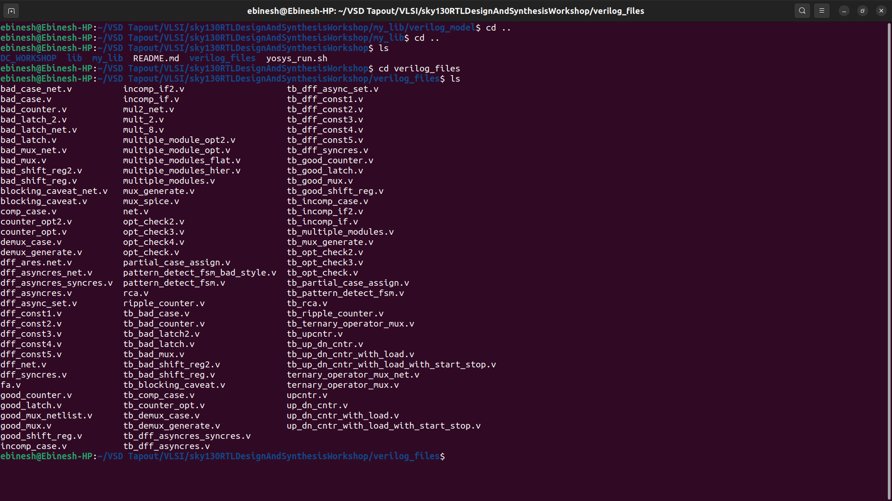

# Day 1: Introduction to Verilog RTL Design and Synthesis
The initial day of the workshop provides an overview of the Icarus Verilog (iverilog) simulator, test bench configuration, simulation flow using iverilog, and hands-on labs with iverilog, GTKWave, and Yosys tools.

## Table of Contents

- [1.1 Overview of Icarus Verilog, RTL Design, and Test Bench](#11-overview-of-icarus-verilog-rtl-design-and-test-bench)  
- [1.2 Running Simulations with Icarus Verilog](#12-running-simulations-with-icarus-verilog)  
- [1.3 Configuring Design and Test Bench](#13-configuring-design-and-test-bench)  
- [1.4 Icarus Verilog Simulation Workflow](#14-icarus-verilog-simulation-workflow)  
- [1.5 Lab Environment Setup](#15-lab-environment-setup)  
- [1.6 Simulating a Multiplexer with Icarus Verilog](#16-simulating-a-multiplexer-with-icarus-verilog)  
- [1.7 Synthesizing Designs with Yosys](#17-synthesizing-designs-with-yosys)  
     - [1.7.1 Yosys Synthesis Workflow](#171-yosys-synthesis-workflow)  
     - [1.7.2 Verifying the Synthesized Netlist](#172-verifying-the-synthesized-netlist)


## 1.1 Overview of Icarus Verilog, RTL Design, and Test Bench
* **RTL Design**: This refers to the Verilog code or collection of Verilog modules that implement the desired functionality to meet specified requirements. Register Transfer Level (RTL) is a design abstraction for modeling digital systems, widely used as the primary model in modern electronic design and verification flows. RTL is typically described using a Hardware Description Language (HDL) like Verilog or VHDL.

* **Test Bench**: A test bench is a setup used to apply input stimuli (test vectors) to the design to verify its functionality. By applying these stimuli and observing the outputs, we can confirm whether the design adheres to the specified requirements.

## 1.2 Running Simulations with Icarus Verilog
* **Simulation**: Simulation involves executing the HDL-coded design (after successful compilation and elaboration) using a specific execution model. This process verifies the functional correctness of a digital design modeled in an HDL like Verilog or VHDL. It ensures the design meets the given specifications.

* **Simulator**: The simulator is the tool that executes the simulation. Here, we use Icarus Verilog (iverilog). The RTL design represents the implementation of the specifications, and its functionality is validated through simulation.

* **How Simulators Operate**: A simulator continuously tracks changes in input signals. When any input changes, the simulator recalculates the output. If inputs remain unchanged, the output is not re-evaluated. The simulator logs output changes to a file based on input variations.

## 1.3 Configuring Design and Test Bench
* The Verilog RTL design includes primary inputs and outputs, which may be singular or multiple.
* Stimuli must be applied to all primary inputs, and the resulting outputs must be observed. This requires a stimulus generator for inputs and an observer for outputs.
* A test bench is written to provide stimuli. The design (module) is instantiated within the test bench, and stimuli are applied to it.
* Notably, the test bench itself does not have primary inputs or outputs.

Below image illustrates the test bench configuration:  


## 1.4 Icarus Verilog Simulation Workflow
* **Simulator Inputs**:  
  The iverilog simulator requires two primary inputs:  
  1. **RTL Design**: The behavioral description of the specifications written in Verilog.  
  2. **Test Bench**: The setup for applying test vectors to verify the design’s functionality and correctness. The test bench instantiates the Verilog module and provides stimuli to its input ports.

* **Simulator Output**:  
  The iverilog simulator generates a Value Change Dump (.vcd) file, which can be visualized using the GTKWave tool.

Below image depicts the complete iverilog simulation workflow:  


## 1.5 Lab Environment Setup
* Log into your lab instance and create a directory named VLSI in your home directory:

```shell
$ mkdir VLSI
```


* Clone the GitHub repository into the VLSI directory:

```
$ cd VLSI
$ git clone https://github.com/kunalg123/sky130RTLDesignAndSynthesisWorkshop.git
```


* Check the contents of the `sky130RTLDesignAndSynthesisWorkshop` directory:

```
$ cd sky130RTLDesignAndSynthesisWorkshop
$ ls -ltr
```


* Explore the `verilog_files` directory, which contains the working files for this workshop:

```shell
cd sky130RTLDesignAndSynthesisWorkshop
ls -ltr
cd verilog_files
```



## 1.6 Simulating a Multiplexer with Icarus Verilog
The simulation process for a multiplexer (MUX) using iverilog follows these steps:
* Iverilog takes the RTL design and test bench as inputs and produces an executable file named `a.out`.
* Running `a.out` generates a simulation output in Value Change Dump (.vcd) format.
* GTKWave is used to visualize the .vcd file as a waveform.

Steps to perform the simulation:
1. Run iverilog with the Verilog design and test bench files to create the executable `a.out`:

```
$ cd sky130RTLDesignAndSynthesisWorkshop
$ ls -ltr
$ cd verilog_files
$ iverilog good_mux.v tb_good_mux.v
```

2. Execute the `a.out` file to generate the .vcd file:

```
$ ./a.out
```


3. Use GTKWave to view the simulation waveform from the .vcd file:

```
$ gtkwave tb_good_mux.vcd
```

4. Drag the signals to the signal column in GTKWave to view them in the waveform window:  


## 1.7 Synthesizing Designs with Yosys
* **Synthesis**: Synthesis transforms an RTL design into a gate-level circuit. Hardware Description Languages (HDLs) like Verilog describe the circuit’s behavior, which is then converted into a physical circuit representation by synthesis tools. The output is a “Gate-Level Netlist,” representing the circuit’s structure in terms of gates and their connections. The synthesis tool used here is Yosys.

In simpler terms:
* Synthesis translates RTL into a gate-level representation.
* The design is converted into interconnected gates and cells.
* The result is a netlist file.

### 1.7.1 Yosys Synthesis Workflow
The synthesis tool takes the RTL design and a liberty file (.lib) as inputs to produce a gate-level netlist.

Below image illustrates the Yosys synthesis workflow:  


Steps to synthesize the multiplexer design (`good_mux.v`):
1. Launch Yosys:

```
$ cd verilog_files
$ yosys
```


2. Load the sky130 standard cell library:

```
$ read_liberty -lib ../my_lib/lib/sky130_fd_sc_hd__tt_025C_1v80.lib
```

**read_liberty**: Reads cells from the liberty file as modules into the current design. The `-lib` option creates empty blackbox modules.

3. Load the RTL design:

```
$ read_verilog good_mux.v
```

**read_verilog**: Loads Verilog modules into the current design.


4. Synthesize the top-level module:

```
$ synth -top good_mux
```

**synth**: Executes the default synthesis script for the specified top module (`good_mux` in this case).  
**-top <module>**: Specifies the top module for synthesis.


5. Map to the standard cell library:

```
$ abc -liberty ../my_lib/lib/sky130_fd_sc_hd__tt_025C_1v80.lib
```

**abc**: Performs technology mapping of Yosys’s internal gate library to the target architecture using the specified liberty file.  
**-liberty <file>**: Generates netlists for the specified cell library.


6. Visualize the synthesized design as a Graphviz diagram:

```
$ show
```

**show**: Generates a Graphviz DOT file for the selected design portion and compiles it into a graphical format (typically SVG or PostScript).


7. Write the netlist to a Verilog file:

```
$ write_verilog -noattr good_mux_netlist.v
```

**write_verilog**: Outputs the current design to a Verilog file.  
**-noattr**: Excludes attributes from the output.  
**good_mux_netlist.v**: The output netlist file name (can be customized).


### 1.7.2 Verifying the Synthesized Netlist
The netlist is a Verilog representation of the design using standard cells from the `sky130_fd_sc_hd__tt_025C_1v80.lib` library. To ensure the synthesis tool correctly translated the RTL design, the netlist must be simulated.

Follow the same iverilog simulation flow as described earlier, replacing the RTL design file with the netlist file (`good_mux_netlist.v`). The primary inputs and outputs remain identical between the RTL design and the netlist, so the same test bench can be used.

## 1.6 Day 1 Summary

| **Topic**              | **Key Points**                                                                 |
|------------------------|--------------------------------------------------------------------------------|
| **Overview**           | Introduces Verilog RTL design, test bench concepts, and simulation workflow using Icarus Verilog. |
| **RTL Design**         | Defines digital system behavior at the register-transfer level; written in Verilog modules. |
| **Test Bench**         | Applies input stimuli to verify design functionality; observes outputs without primary IO. |
| **Simulation Workflow**| Simulator executes RTL + test bench; tracks input changes; generates .vcd for GTKWave visualization. |
| **Lab Setup**          | Creates working directories, clones GitHub repository, and explores Verilog files for hands-on exercises. |
| **Multiplexer Simulation** | Compile RTL + test bench with iverilog; run executable; visualize signals in GTKWave. |
| **Yosys Synthesis**    | Transforms RTL into gate-level netlist; includes reading library, synthesizing top module, technology mapping, visualizing, and writing netlist. |
| **Netlist Verification**| Simulate synthesized netlist with existing test bench to confirm functional equivalence with RTL. |
