# 1. Day 2 - Timing Libraries, Hierarchical vs. Flat Synthesis, and Efficient Flip-Flop Coding

Welcome to Day 2 of our hands-on workshop on digital design with the SKY130 process! This module dives into the essentials of timing libraries, contrasts hierarchical and flat synthesis techniques, and explores optimized coding for flip-flops. Designed for clarity and depth, this guide includes practical examples, comparison tables, and Verilog snippets to make concepts immediately graspable. Whether you're a beginner or refining your skills, you'll find unique insights, like trade-off analyses and real-world application tips, to stand out in your designs.

## Table of Contents
1. [Introduction to Timing Libraries](#1.1-introduction-to-timing-libraries)
   - [Library Naming Conventions](#1.1.1-library-naming-conventions)
   - [Understanding Liberty Files (.lib)](#1.1.2-understanding-liberty-files)
2. [Hierarchical vs. Flat Synthesis](#1.2-hierarchical-vs-flat-synthesis)
   - [Hierarchical Synthesis](#1.2.1-hierarchical-synthesis)
   - [Flat Synthesis](#1.2.2-flat-synthesis)
   - [Submodule-Level Synthesis](#1.2.3-submodule-level-synthesis)
3. [Efficient Flip-Flop Coding Styles](#1.3-efficient-flip-flop-coding-styles)
   - [Why Flip-Flops Are Essential](#1.3.1-why-flip-flops-are-essential)
   - [Flip-Flop Coding Styles](#1.3.2-flip-flop-coding-styles)

---

## 1.1 Introduction to Timing Libraries

Timing libraries form the backbone of digital design, offering precise data on how standard cells perform under various conditions. Here, we unpack the SKY130 libraries, emphasizing their structure and selection for optimal designs.

### 1.1.1 Library Naming Conventions

SkyWater's SKY130 process provides seven standard cell libraries, each suited for specific needs like density or speed, across three cell heights. Our focus library, `sky130_fd_sc_hd__tt_025C_1v80.lib`, prioritizes **high density**—ideal for compact layouts with reduced power draw, though it trades off some drive capability.

The naming follows a logical pattern:
```
<Process>_<Source>_<Type>[_<Variant>]
```

To clarify, here's a breakdown table for our library:

| Component | Value   | Description                          |
|-----------|---------|--------------------------------------|
| Process   | sky130 | The SKY130 technology node.         |
| Source    | fd     | From SkyWater Foundry.              |
| Type      | sc     | Digital standard cells.             |
| Variant   | hd     | High-density focus.                 |
| Corner    | tt     | Typical process corner.             |
| Temp      | 025C   | 25°C operating temperature.         |
| Voltage   | 1v80   | 1.8V supply voltage.                |

This table helps quickly decode library suitability for your project.

### 1.1.2 Understanding Liberty Files

Liberty files (`.lib`) are the industry-standard ASCII format for cell characterization, covering timing, power, and more. They compile logic modules like gates in various strengths.

In `sky130_fd_sc_hd__tt_025C_1v80.lib`, cells like `sky130_fd_sc_hd__a21110_1` detail a 5-input logic (AND of two, ORed with three) with leakage power across 32 input states.

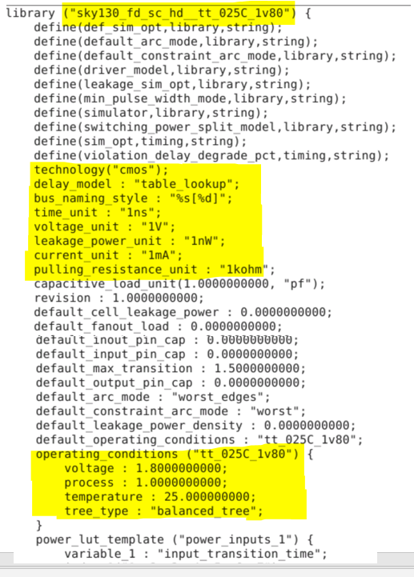

In `sky130_fd_sc_hd__tt_025C_1v80.lib`, cells like `sky130_fd_sc_hd__a21110_1` detail a 5-input logic (AND of two, ORed with three) with leakage power across 32 input states.

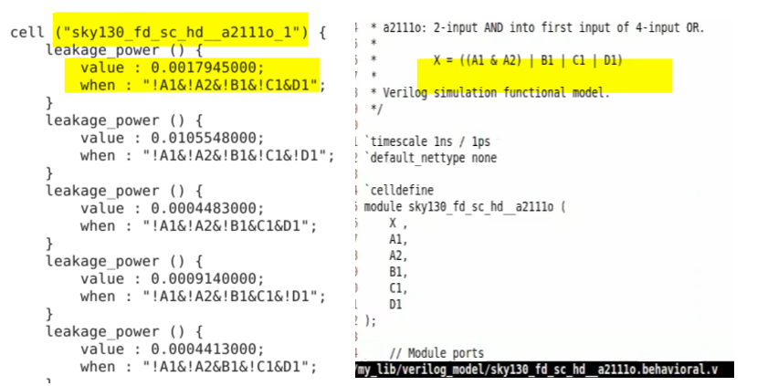

Libraries offer gate "flavors" for flexibility. For AND gates:

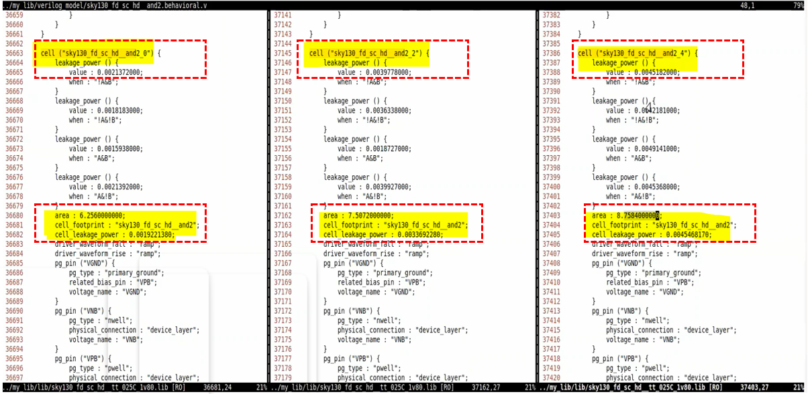

Comparison table of AND variants:

| Gate Variant | Area (Relative) | Power Consumption (Relative) | Delay (Relative) | Best Use Case                  |
|--------------|-----------------|------------------------------|------------------|--------------------------------|
| and2_0      | Smallest       | Lowest                      | Highest         | Low-power, space-constrained designs |
| and2_2      | Medium         | Medium                      | Medium          | Balanced performance          |
| and2_4      | Largest        | Highest                     | Lowest          | High-speed critical paths     |

**Insight**: Wider transistors in larger cells boost speed but inflate area and power—choose based on your design's priorities, like battery life vs. throughput.

---

## 1.2 Hierarchical vs. Flat Synthesis

Synthesis converts RTL to gates. We compare hierarchical (preserving structure) and flat (collapsing it) approaches, with tips for scaling large designs.

### 1.2.1 Hierarchical Synthesis

Imagine an RTL with a top module using two submodules:

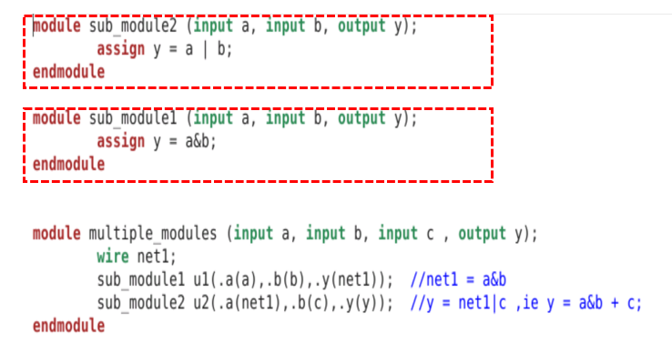

Hierarchical synthesis keeps submodules intact in the netlist, aiding modularity.

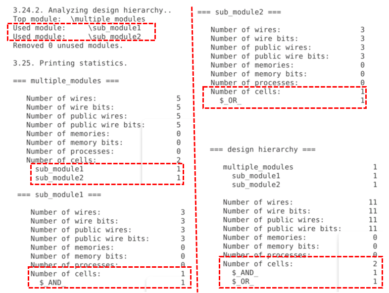

Let's examine the netlist generated by the ABC tool after synthesis. The hierarchy of the design is preserved, as seen with sub-modules 'u1' and 'u2' being instantiated instead of individual gates, exactly as defined in the RTL code.

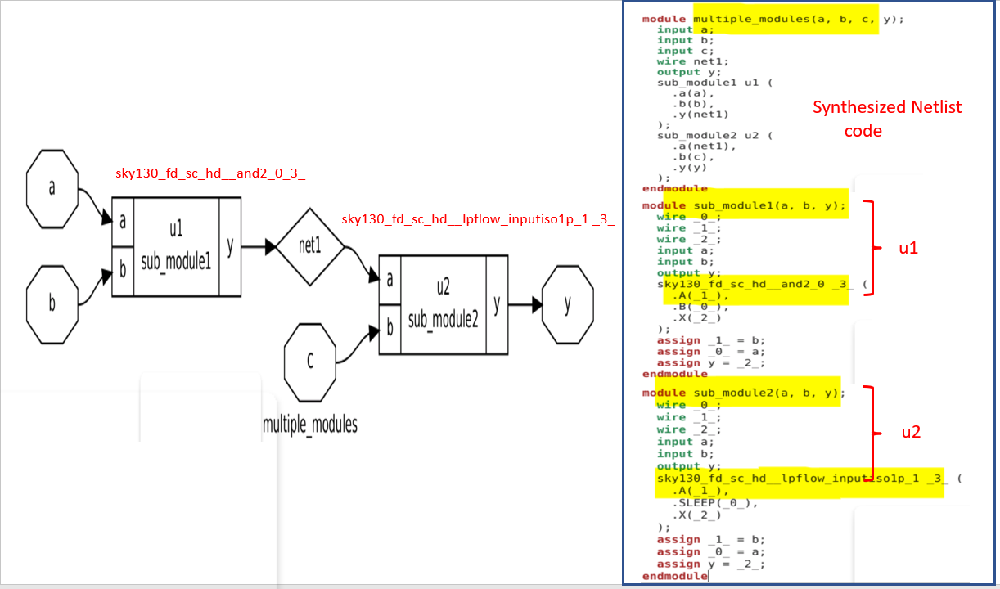

Yosys commands:
```
$ read_liberty -lib ../my_lib/lib/sky130_fd_sc_hd__tt_025C_1v80.lib 
$ read_verilog multiple_modules.v
$ synth -top multiple_modules
$ abc -liberty ../my_lib/lib/sky130_fd_sc_hd__tt_025C_1v80.lib
$ write_verilog -noattr multiple_modules_hier.v
```

**Unique Tip**: Use this for team workflows—submodules can be developed independently.

### 1.2.2 Flat Synthesis

Flattening dissolves hierarchy, embedding gates directly for potential optimization.

Use `flatten` in Yosys:
```
read_liberty -lib ../my_lib/lib/sky130_fd_sc_hd__tt_025C_1v80.lib 
read_verilog multiple_modules.v
synth -top multiple_modules
abc -liberty ../my_lib/lib/sky130_fd_sc_hd__tt_025C_1v80.lib
show
write_verilog -noattr multiple_modules_hier.v
!gvim multiple_modules_hier.v
flatten
write_verilog -noattr multiple_modules_flat.v
!gvim multiple_modules_flat.v
```

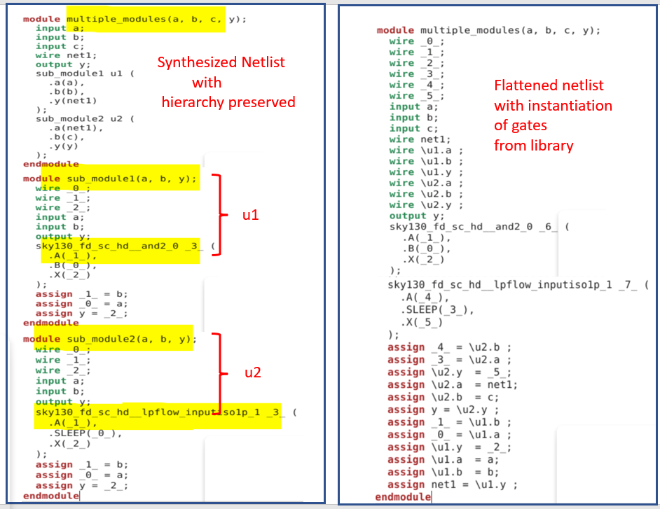
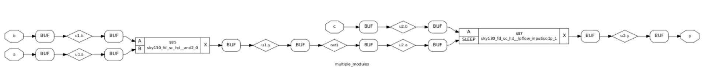

Comparison table:

| Aspect              | Hierarchical Synthesis                  | Flat Synthesis                        |
|---------------------|-----------------------------------------|---------------------------------------|
| Structure          | Preserves modules                      | Collapses to single-level gates      |
| Debug Ease         | High (traceable hierarchy)             | Low (flattened, harder to follow)    |
| Optimization       | Moderate (module boundaries limit)     | High (global optimizations possible) |
| File Size          | Smaller netlist                        | Larger, more detailed                |
| Use Case           | Modular designs, IP reuse              | Performance-critical, compact chips  |

**Pro Tip**: Flatten post-debug for final tweaks.

### 1.2.3 Submodule-Level Synthesis

For efficiency in repeated submodules, synthesize one and replicate—saves runtime on big designs.

Example for `sub_module1`:
```
$ read_liberty -lib ../my_lib/lib/sky130_fd_sc_hd__tt_025C_1v80.lib 
$ read_verilog multiple_modules.v
$ synth -top sub_module1
$ abc -liberty ../my_lib/lib/sky130_fd_sc_hd__tt_025C_1v80.lib
$ write_verilog -noattr multiple_modules_sub.v
```

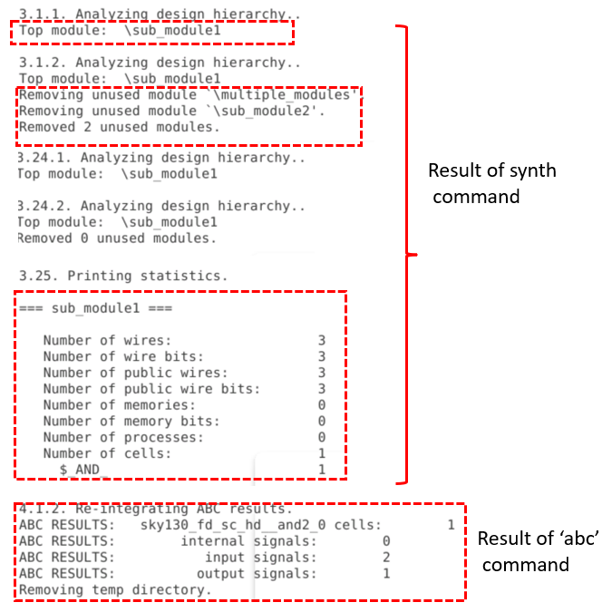
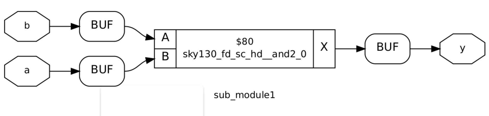

**Unique Insight**: In million-gate ASICs, this divide-and-conquer reduces tool crashes and iteration time.

---

## 1.3 Efficient Flip-Flop Coding Styles

Flip-flops stabilize circuits against glitches. We cover fundamentals and styles with Verilog examples.

### 1.3.1 Why Flip-Flops Are Essential

Combinational delays cause glitches—e.g., this circuit should output 1 always, but delays glitch it:

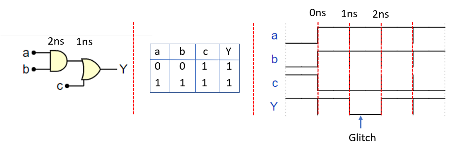

Flip-flops store values on clock edges, blocking glitch propagation.

**Note**: Initialize flops to avoid 'X' states; use SET/RESET pins.

### 1.3.2 Flip-Flop Coding Styles

Map flops with `dfflibmap`:
```
dfflibmap -liberty ../my_lib/lib/sky130_fd_sc_hd__tt_025C_1v80.lib
```

Styles table:

| Style                      | Description                            | Sync/Async | Verilog Snippet Example                                                                 |
|----------------------------|----------------------------------------|------------|-----------------------------------------------------------------------------------------|
| Asynchronous Reset        | Resets to 0 independent of clock.     | Async     | ```module dff_asyncres (input clk, reset, d; output reg q); always @(posedge clk or posedge reset) if (reset) q <= 0; else q <= d; endmodule``` |
| Asynchronous Set          | Sets to 1 independent of clock.       | Async     | Similar to reset, but q <= 1 on set.                                                   |
| Synchronous Reset         | Resets to 0 on clock edge.            | Sync      | ```module dff_syncres (input clk, reset, d; output reg q); always @(posedge clk) if (reset) q <= 0; else q <= d; endmodule``` |
| Async & Sync Reset        | Combines both for flexibility.        | Both      | ```module dff_async_syncres (input clk, async_reset, sync_reset, d; output reg q); always @(posedge clk or posedge async_reset) if (async_reset) q <= 0; else if (sync_reset) q <= 0; else q <= d; endmodule``` |

1. Asynchronous Reset:
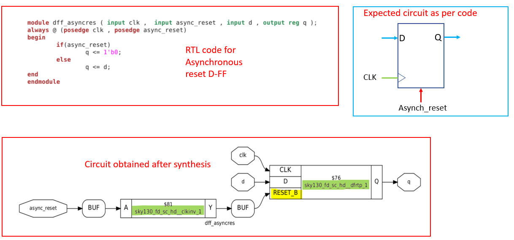
Synthesis:
```
$ read_liberty -lib ../my_lib/lib/sky130_fd_sc_hd__tt_025C_1v80.lib 
$ read_verilog dff_asyncre.v
$ synth -top dff_asyncres
$ dfflibmap -liberty ../my_lib/lib/sky130_fd_sc_hd__tt_025C_1v80.lib
$ abc -liberty ../my_lib/lib/sky130_fd_sc_hd__tt_025C_1v80.lib
$ show
```

2. Asynchronous Set:
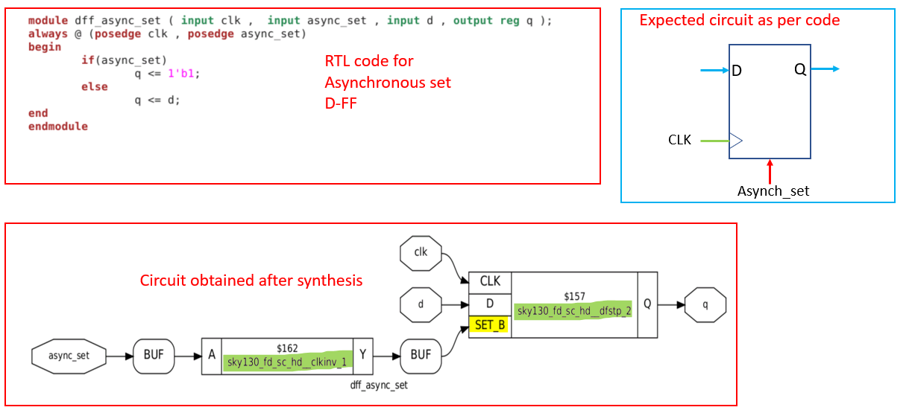

3. Synchronous Reset:
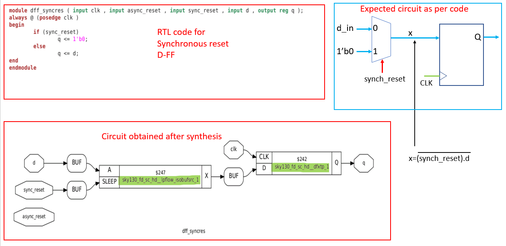

4. Async & Sync Reset:
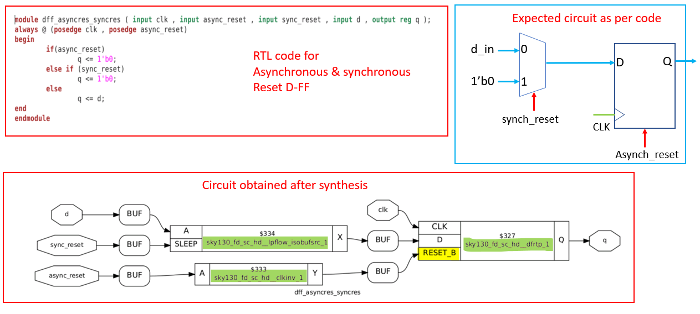

**Note**: Avoid set + reset combos to prevent races.

**Unique Tip**: In safety-critical systems, prefer async resets for instant recovery.

## Summary

| Key Topic                  | Core Takeaway                                                                 | Creative Tip for SKY130 Designs                  |
|----------------------------|-------------------------------------------------------------------------------|--------------------------------------------------|
| **Timing Libraries**      | Decode .lib files for cell timing/power; choose variants for density vs. speed. | Mix small cells for power savings, big ones for hot paths—like a balanced meal! |
| **Synthesis Strategies**  | Hierarchical for modularity; flat for optimization; submodule for big projects. | Start hierarchical, flatten at the end: it's like sketching rough, then polishing the sculpture. |
| **Flip-Flop Coding**      | Use async/syn resets to block glitches; always initialize to avoid chaos.     | Code flops like safety nets—async for quick escapes, sync for clock dances. |
| **Overall Impact**        | Build glitch-free, scalable circuits with Yosys commands and library smarts.  | Tinker boldly: one command tweak could shave 20% power—your innovation playground! |
