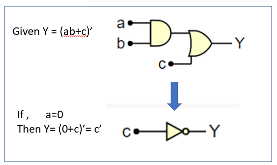
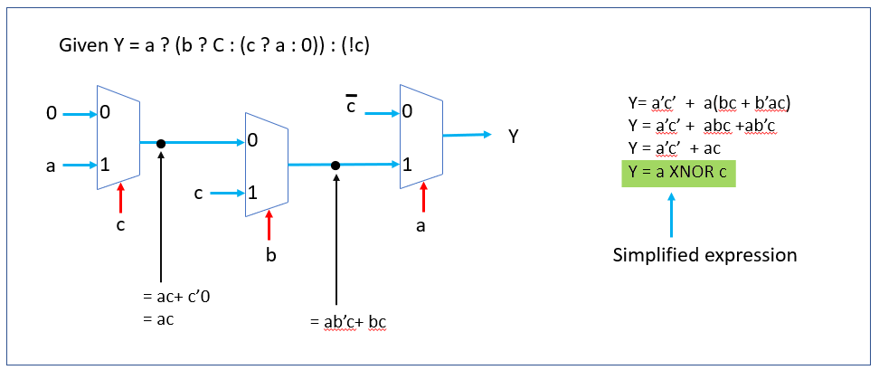
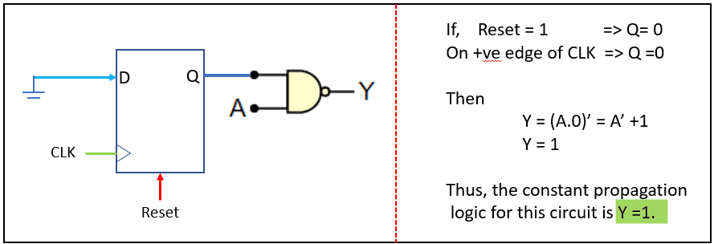
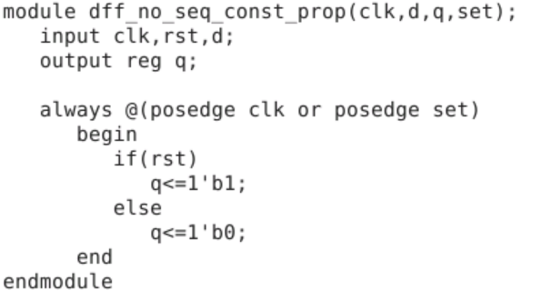
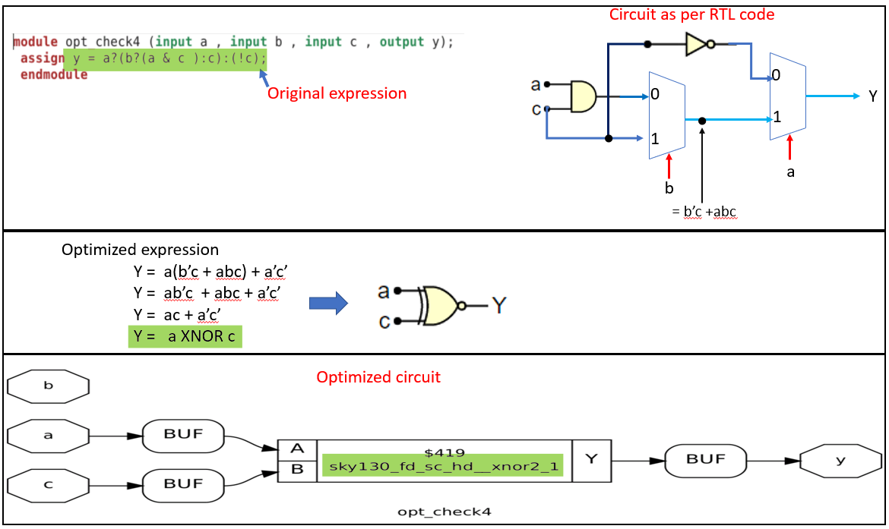
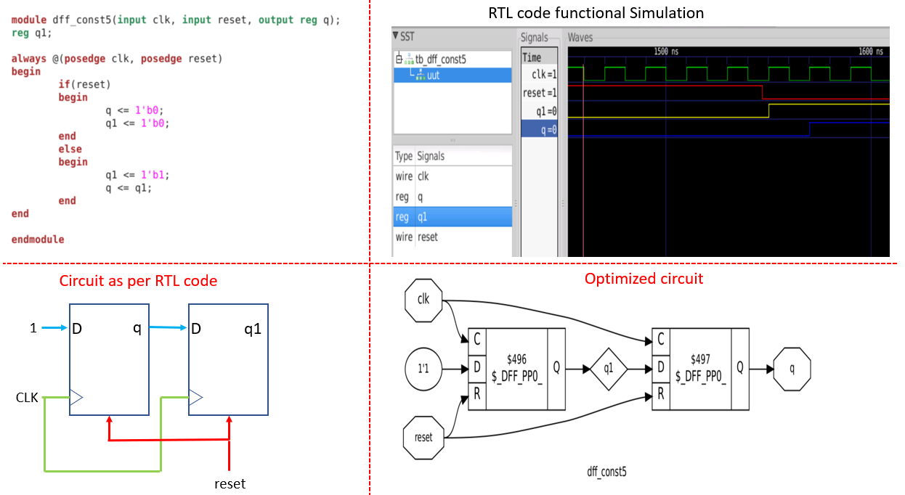
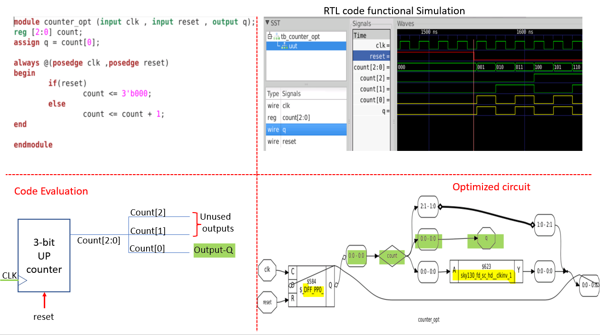

# Day 3 Optimizing Combinational and Sequential Logic

## Table of Contents

   3.1 [Overview of Logic Optimization](#31-overview-of-logic-optimization)  
   3.2 [Combinational Logic Optimization Techniques](#32-combinational-logic-optimization-techniques)  
       3.2.1 [Constant Propagation](#321-constant-propagation)  
       3.2.2 [Boolean Algebra Simplification](#322-boolean-algebra-simplification)  
   3.3 [Sequential Logic Optimization Techniques](#33-sequential-logic-optimization-techniques)  
       3.3.1 [Sequential Constant Propagation](#331-sequential-constant-propagation)  
       3.3.2 [Advanced Optimization Methods](#332-advanced-optimization-methods)  
   3.4 [Logic Optimization Using Yosys](#34-logic-optimization-using-yosys)  
       3.4.1 [Combinational Optimization in Yosys](#341-combinational-optimization-in-yosys)  
       3.4.2 [Sequential Optimization in Yosys](#342-sequential-optimization-in-yosys)  
   3.5 [Optimizing Unused Outputs](#35-optimizing-unused-outputs)  
   3.6 [Day 3 Summary](#36-day-3-summary)

## 3.1 Overview of Logic Optimization
Logic optimization involves transforming a logic circuit to achieve an equivalent design that meets specific constraints, such as timing, area, or power efficiency. The goal is to streamline the design, reducing resource usage and improving simulation performance. By minimizing the number of gates or statements in the compiled code, optimization reduces program size, execution time, and power consumption, ensuring efficient hardware implementation.

| **Aspect**         | **Purpose**                              |
|--------------------|------------------------------------------|
| Timing             | Meet clock frequency requirements        |
| Area               | Reduce silicon footprint                 |
| Power              | Lower energy consumption                 |

## 3.2 Combinational Logic Optimization Techniques
Combinational logic optimization focuses on simplifying logic expressions to create compact, power-efficient designs. Key methods include constant propagation and Boolean algebra simplification, which reduce redundant operations and gate counts.

### 3.2.1 Constant Propagation
Constant propagation replaces known constant values in expressions, eliminating unnecessary computations. For instance, if a circuit input is fixed, the logic can be simplified by propagating this constant to the output, reducing the circuit's complexity.



### 3.2.2 Boolean Algebra Simplification
This technique applies Boolean algebra rules to simplify complex expressions while preserving functionality. Tools like Karnaugh maps or the Quine-McCluskey method help identify minimal expressions, reducing gate count and power usage.

| **Method**            | **Description**                              |
|-----------------------|----------------------------------------------|
| Karnaugh Map          | Visual tool for simplifying up to 6 variables |
| Quine-McCluskey       | Algorithmic approach for larger expressions   |



## 3.3 Sequential Logic Optimization Techniques
Sequential logic optimization enhances circuits with memory elements, like flip-flops, to improve performance and efficiency. Techniques range from basic constant propagation to advanced methods like state optimization and retiming.

### 3.3.1 Sequential Constant Propagation
This method propagates constant values through sequential elements. If a flip-flop’s input is constant, its output may also become constant, allowing optimization. However, this applies only when the output is consistently fixed, regardless of clock or reset signals.

| **Condition**                 | **Outcome**                          |
|-------------------------------|--------------------------------------|
| Constant input to flip-flop    | Potential constant output           |
| Non-constant input (e.g., data) | No optimization possible            |



*Example of Non-Optimizable Case*: If a flip-flop’s output depends on variable inputs (e.g., `set = 1` sets `Q = 1`, but `set = 0` and `clk = 1` sets `Q = 0`), no constant propagation occurs.



### 3.3.2 Advanced Optimization Methods
- **State Optimization**: Removes unused or redundant states in finite state machines, minimizing the number of states and transitions.
- **Retiming**: Adjusts flip-flop positions to balance combinational delays, improving clock frequency and performance.
- **Sequential Logic Cloning**: Replicates logic to optimize placement during physical-aware synthesis, reducing wire delays.

| **Technique**         | **Benefit**                              |
|-----------------------|------------------------------------------|
| State Optimization    | Reduces state machine complexity         |
| Retiming              | Improves timing by redistributing delays |
| Logic Cloning         | Enhances placement in physical design    |

## 3.4 Logic Optimization Using Yosys
Yosys, an open-source synthesis tool, automates combinational and sequential logic optimization, producing efficient designs from RTL code.

### 3.4.1 Combinational Optimization in Yosys
Consider an example with a Verilog file (`opt_check4.v`):



**Synthesis Commands**:
```
$ read_liberty -lib ../my_lib/lib/sky130_fd_sc_hd__tt_025C_1v80.lib
$ read_verilog opt_check4.v
$ synth -top opt_check
$ opt_clean -purge
$ abc -liberty ../my_lib/lib/sky130_fd_sc_hd__tt_025C_1v80.lib
$ show
```

- **opt_clean**: Removes unused wires and cells, cleaning up after other optimization passes.
- **-purge**: Deletes internal nets with public names, further streamlining the design.

### 3.4.2 Sequential Optimization in Yosys
For a sequential circuit (`dff_const5.v`), Yosys evaluates whether optimization is possible. In cases where the circuit matches the RTL behavior, no further simplification occurs.



## 3.5 Optimizing Unused Outputs
In some designs, synthesis tools eliminate logic unrelated to primary outputs. For example, in `counter_opt.v`, a 3-bit counter may appear to require three flip-flops, but if only one bit affects the output (`q = count[0]`), Yosys optimizes the design to use a single flip-flop.



| **Design Input**      | **Optimized Output**                     |
|-----------------------|------------------------------------------|
| 3-bit counter         | Single flip-flop for count[0]            |
| Output follows count[0] | Compliment of output as flip-flop input |

This ensures only essential logic is retained, reducing area and power.

## 3.6 Day 3 Summary
| **Topic**                     | **Key Points**                                                                 |
|-------------------------------|--------------------------------------------------------------------------------|
| **Overview**                  | Optimizes circuits for timing, area, and power; reduces gate count and execution time. |
| **Combinational Optimization** | Uses constant propagation and Boolean simplification to minimize logic complexity. |
| **Sequential Optimization**   | Applies constant propagation, state reduction, retiming, and logic duplication.   |
| **Yosys Workflow**            | Automates optimization with commands like `opt_clean` and `synth` for efficient designs. |
| **Unused Outputs**            | Eliminates logic not affecting outputs, e.g., reducing a 3-bit counter to one flip-flop. |
