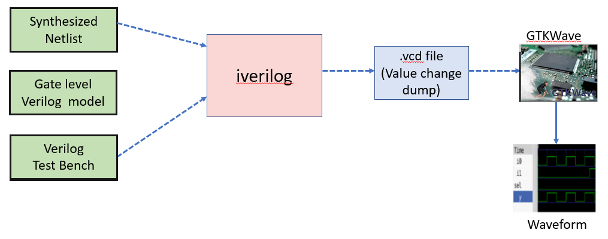
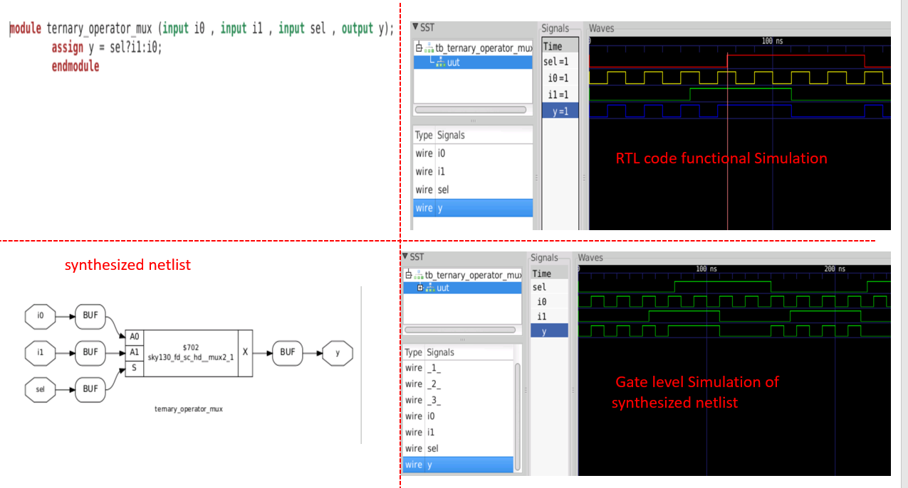
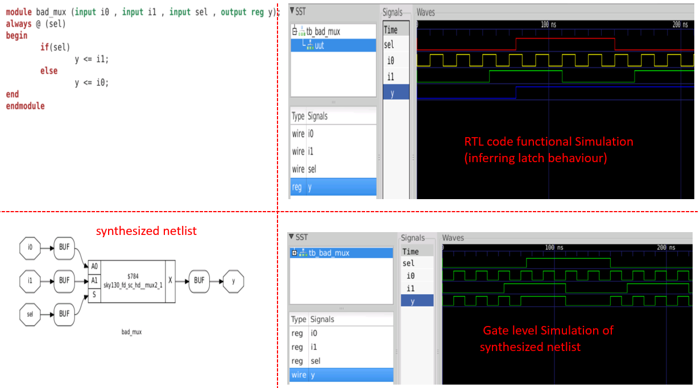
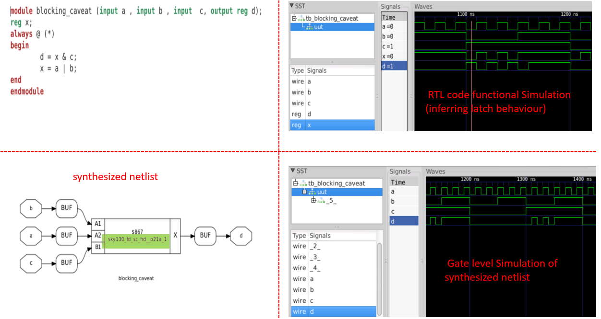

# Day 4 - Advanced Verification Techniques: Gate-Level Simulation and Design Integrity

## 📖 Table of Contents

- [📋 Introduction](#-introduction)
- [4.1 Understanding Gate-Level Simulation (GLS)](#41-understanding-gate-level-simulation-gls)
  - [What is Gate-Level Simulation?](#what-is-gate-level-simulation)
  - [Why GLS Matters in Modern VLSI](#why-gls-matters-in-modern-vlsi)
  - [The GLS Verification Flow](#the-gls-verification-flow)
  - [GLS Implementation Categories](#gls-implementation-categories)
- [4.2 Implementing GLS with Iverilog](#42-implementing-gls-with-iverilog)
  - [GLS Setup Architecture](#gls-setup-architecture)
  - [Essential Input Components](#essential-input-components)
  - [Practical GLS Workflow](#practical-gls-workflow)
- [4.3 Synthesis-Simulation Mismatch: The Hidden Challenge](#43-synthesis-simulation-mismatch-the-hidden-challenge)
  - [Understanding the Problem](#understanding-the-problem)
  - [Root Causes Analysis](#root-causes-analysis)
- [4.4 Case Study: Missing Sensitivity List](#44-case-study-missing-sensitivity-list)
  - [Scenario Analysis: Good vs Bad MUX Design](#scenario-analysis-good-vs-bad-mux-design)
  - [Verification Flow for Sensitivity List Analysis](#verification-flow-for-sensitivity-list-analysis)
  - [Results Analysis](#results-analysis)
  - [Impact Analysis Table](#impact-analysis-table)
- [4.5 Blocking vs Non-Blocking Assignments](#45-blocking-vs-non-blocking-assignments)
  - [Fundamental Concepts](#fundamental-concepts)
  - [Best Practices Guidelines](#best-practices-guidelines)
  - [Common Pitfalls and Solutions](#common-pitfalls-and-solutions)
- [4.6 Advanced Case Study: Blocking Assignment Caveats](#46-advanced-case-study-blocking-assignment-caveats)
  - [The Problem Scenario](#the-problem-scenario)
  - [Detailed Analysis](#detailed-analysis)
  - [Behavior Comparison](#behavior-comparison)
  - [Why This Mismatch Occurs](#why-this-mismatch-occurs)
  - [Resolution Strategy](#resolution-strategy)
- [4.7 Professional Verification Methodology](#47-professional-verification-methodology)
  - [Comprehensive Verification Checklist](#comprehensive-verification-checklist)
  - [Debug Methodology for Mismatches](#debug-methodology-for-mismatches)
- [4.8 Day 4 Learning Summary](#48-day-4-learning-summary)
  - [Key Concepts Mastered](#key-concepts-mastered)
  - [Technical Skills Developed](#technical-skills-developed)
- [📚 Additional Resources](#-additional-resources)
  - [Recommended Reading](#recommended-reading)
  - [Online Resources](#online-resources)
  - [Practice Exercises](#practice-exercises)

---

## 📋 Introduction

Welcome to Day 4 of our comprehensive VLSI design journey! Today we dive deep into the critical world of post-synthesis verification, exploring Gate-Level Simulation (GLS) and understanding the nuances that can lead to synthesis-simulation mismatches. This session is crucial for ensuring your digital designs work flawlessly in silicon.

As VLSI designs become increasingly complex, the gap between what we simulate and what actually gets fabricated can lead to costly silicon failures. This module equips you with the knowledge to bridge this gap effectively using industry-standard tools and methodologies.

---

## 4.1 Understanding Gate-Level Simulation (GLS)

### What is Gate-Level Simulation?

**Gate-Level Simulation (GLS)** represents a pivotal verification step in the VLSI design flow. Unlike RTL simulation that operates on behavioral descriptions, GLS verifies the actual synthesized netlist - the real implementation that will be fabricated.

Think of it this way: if RTL simulation is like testing a blueprint, GLS is like testing the actual building before occupancy.

### Why GLS Matters in Modern VLSI

| **Aspect** | **Static Analysis Limitations** | **GLS Benefits** |
|------------|--------------------------------|------------------|
| **Dynamic Behavior** | Cannot verify real-time circuit behavior | Validates actual switching behavior |
| **Power Analysis** | Limited power estimation capabilities | Accurate power consumption analysis |
| **Timing Verification** | Basic timing checks only | Comprehensive timing validation |
| **DFT Integration** | No test structure verification | Verifies inserted DFT structures |

### The GLS Verification Flow

The gate-level simulation process follows this systematic approach:

```
RTL Design → Synthesis → Gate-Level Netlist → GLS Verification
```

**Key Components:**
- **Netlist**: Complete connection list of gates and IP models
- **Test Bench**: Same TB used for RTL (logical equivalence principle)
- **Gate Models**: Standard cell library models for simulation
- **Timing Information**: Delay annotation for timing-aware simulation

### GLS Implementation Categories

| **GLS Type** | **Purpose** | **Use Case** | **Complexity** |
|--------------|-------------|--------------|----------------|
| **Functional GLS** | Logic verification only | Quick functional checks | Low |
| **Timing-Aware GLS** | Logic + timing validation | Pre-tapeout verification | High |

---

## 4.2 Implementing GLS with Iverilog

### GLS Setup Architecture

The following diagram illustrates the complete GLS setup using Iverilog:



### Essential Input Components

**1. Gate-Level Verilog Models**
These models define the behavior of standard cells used in your netlist:

| **Model Type** | **Description** | **File Examples** |
|----------------|-----------------|-------------------|
| **Primitives** | Basic logic gates | `primitives.v` |
| **Standard Cells** | Complex cells (flip-flops, latches) | `sky130_fd_sc_hd.v` |
| **Memory Models** | SRAM/ROM models | `memory_models.v` |

**2. Synthesized Netlist**
- Post-synthesis structural representation
- Gate-level connectivity information
- Instance-based design hierarchy

**3. Test Bench**
- Identical to RTL simulation test bench
- Ensures consistent verification approach
- Validates logical equivalence

### Practical GLS Workflow

```bash
# Step 1: Compile GLS simulation
$ iverilog ../my_lib/verilog_model/primitives.v \
           ../my_lib/verilog_model/sky130_fd_sc_hd.v \
           design_net.v \
           tb_design.v

# Step 2: Execute simulation
$ ./a.out

# Step 3: Analyze waveforms
$ gtkwave tb_design.vcd
```

---

## 4.3 Synthesis-Simulation Mismatch: The Hidden Challenge

### Understanding the Problem

Even though the synthesized netlist should represent your RTL design accurately, discrepancies can occur. These mismatches can lead to:

- **Functional Failures**: Design doesn't work as intended
- **Timing Violations**: Performance requirements not met
- **Power Issues**: Unexpected power consumption
- **Silicon Failures**: Costly re-spins and delays

### Root Causes Analysis

| **Category** | **Issue** | **Impact** | **Solution** |
|--------------|-----------|------------|--------------|
| **Coding Style** | Missing sensitivity list | Incorrect simulation behavior | Use `always @(*)` |
| **Assignment Type** | Blocking vs Non-blocking | Race conditions | Follow coding guidelines |
| **Language Constructs** | Non-standard Verilog | Synthesis tool confusion | Stick to synthesizable subset |

---

## 4.4 Case Study: Missing Sensitivity List

### Scenario Analysis: Good vs Bad MUX Design

Let's examine two MUX implementations to understand sensitivity list importance:

#### Implementation Comparison

**Good MUX Design:**
```verilog
always @(*) begin
    if (sel)
        y = i1;
    else
        y = i0;
end
```

**Problematic MUX Design:**
```verilog
always @(sel) begin  // Missing i0, i1 in sensitivity list
    if (sel)
        y = i1;
    else
        y = i0;
end
```

### Verification Flow for Sensitivity List Analysis

#### Step 1: RTL Simulation
```bash
$ iverilog ternary_operator_mux.v tb_ternary_operator_mux.v
$ ./a.out
$ gtkwave tb_ternary_operator_mux.vcd
```

#### Step 2: Synthesis Process
```bash
$ read_liberty -lib ../my_lib/lib/sky130_fd_sc_hd__tt_025C_1v80.lib 
$ read_verilog ternary_operator_mux.v
$ synth -top ternary_operator_mux
$ abc -liberty ../my_lib/lib/sky130_fd_sc_hd__tt_025C_1v80.lib
$ write_verilog -noattr ternary_operator_mux_net.v
```

#### Step 3: Gate-Level Simulation
```bash
$ iverilog ../my_lib/verilog_model/primitives.v \
           ../my_lib/verilog_model/sky130_fd_sc_hd.v \
           ternary_operator_mux_net.v \
           tb_ternary_operator_mux.v
$ ./a.out
$ gtkwave tb_ternary_operator_mux_net.vcd
```

### Results Analysis



**Good MUX Results:**
- RTL and GLS waveforms match perfectly
- Proper MUX functionality observed
- No synthesis-simulation mismatch



**Bad MUX Results:**
- RTL simulation shows latch behavior
- GLS shows correct MUX behavior
- Clear synthesis-simulation mismatch identified

### Impact Analysis Table

| **Simulation Type** | **Good MUX** | **Bad MUX** |
|-------------------|--------------|-------------|
| **RTL Behavior** | Correct MUX | Latch-like behavior |
| **GLS Behavior** | Correct MUX | Correct MUX |
| **Match Status** | ✅ Perfect Match | ❌ Mismatch Detected |
| **Issue** | None | Missing sensitivity list |

---

## 4.5 Blocking vs Non-Blocking Assignments

### Fundamental Concepts

Understanding assignment types is crucial for writing synthesizable and simulation-friendly code:

#### Blocking Assignments (=)

| **Characteristic** | **Description** | **Example** |
|-------------------|-----------------|-------------|
| **Execution** | Sequential, in order | `a = b; c = a;` |
| **Timing** | Immediate assignment | Values updated instantly |
| **Use Case** | Combinational logic | Always @(*) blocks |
| **Behavior** | Procedural, step-by-step | Like software programming |

#### Non-Blocking Assignments (<=)

| **Characteristic** | **Description** | **Example** |
|-------------------|-----------------|-------------|
| **Execution** | Concurrent, parallel | `a <= b; c <= a;` |
| **Timing** | End-of-cycle assignment | Values updated together |
| **Use Case** | Sequential logic | Always @(posedge clk) blocks |
| **Behavior** | Hardware-like | Real flip-flop behavior |

### Best Practices Guidelines

| **Logic Type** | **Recommended Assignment** | **Rationale** |
|----------------|---------------------------|---------------|
| **Combinational** | Blocking (=) | Immediate evaluation needed |
| **Sequential** | Non-blocking (<=) | Avoids race conditions |
| **Mixed Logic** | Follow context | Use appropriate type per section |

### Common Pitfalls and Solutions

#### Pitfall: Blocking Assignment in Sequential Logic

**Problematic Code:**
```verilog
always @(posedge clk) begin
    d = x & a;  // Blocking assignment
    x = a & b;  // This affects 'd' immediately
end
```

**Consequences:**
- Race conditions in simulation
- Unpredictable behavior
- Synthesis-simulation mismatch

**Correct Implementation:**
```verilog
always @(posedge clk) begin
    d <= x & a;  // Non-blocking assignment
    x <= a & b;  // Both update at cycle end
end
```

---

## 4.6 Advanced Case Study: Blocking Assignment Caveats

### The Problem Scenario



### Detailed Analysis

**Code Under Test:**
```verilog
always @(posedge clk) begin
    d = x & a;    // 'd' uses old value of 'x'
    x = a & b;    // 'x' updated after 'd' calculation
end
```

### Behavior Comparison

| **Simulation Type** | **Observed Behavior** | **Reason** |
|-------------------|---------------------|------------|
| **RTL Simulation** | Latch-like behavior | Uses old 'x' value for 'd' |
| **GLS Simulation** | Correct gate behavior | Synthesis interprets intent correctly |
| **Hardware Reality** | Matches GLS | Physical gates implement correct logic |

### Why This Mismatch Occurs

1. **RTL Simulator Perspective**: Executes statements sequentially
2. **Synthesis Tool Perspective**: Interprets design intent
3. **Hardware Reality**: All logic operates concurrently

### Resolution Strategy

```verilog
// Correct implementation using non-blocking assignments
always @(posedge clk) begin
    d <= x & a;   // Both 'd' and 'x' use current cycle values
    x <= a & b;   // Updated simultaneously at cycle end
end
```

---

## 4.7 Professional Verification Methodology

### Comprehensive Verification Checklist

| **Verification Stage** | **Check Items** | **Tools** | **Pass Criteria** |
|----------------------|----------------|-----------|-------------------|
| **RTL Simulation** | Functional correctness | Iverilog, ModelSim | All test cases pass |
| **Synthesis** | Resource utilization | Yosys, Design Compiler | Meets area/timing goals |
| **GLS** | Netlist functionality | Iverilog + gate models | Matches RTL behavior |
| **STA** | Timing closure | OpenSTA, PrimeTime | No violations |

### Debug Methodology for Mismatches

1. **Identify Discrepancy**: Compare RTL vs GLS waveforms
2. **Isolate Root Cause**: Check sensitivity lists, assignments
3. **Apply Fix**: Modify RTL code appropriately
4. **Re-verify**: Run complete flow again
5. **Document**: Record issue and solution for future reference

---

## 4.8 Day 4 Learning Summary

### Key Concepts Mastered

| **Topic** | **Learning Objective** | **Practical Skill** | **Industry Relevance** |
|-----------|----------------------|-------------------|----------------------|
| **GLS Fundamentals** | Understand post-synthesis verification | Setup and run GLS simulations | Critical for tapeout success |
| **Simulation Tools** | Master Iverilog for GLS | Debug using GTKWave | Industry-standard workflow |
| **Coding Best Practices** | Write synthesizable Verilog | Avoid common pitfalls | Professional code quality |
| **Debug Techniques** | Identify and fix mismatches | Systematic problem solving | Essential for VLSI engineers |

### Technical Skills Developed

✅ **GLS Setup and Execution**
- Configure Iverilog for gate-level simulation
- Integrate standard cell libraries
- Generate and analyze timing-aware simulations

✅ **Mismatch Detection and Resolution**
- Identify synthesis-simulation discrepancies
- Debug sensitivity list issues
- Resolve blocking/non-blocking assignment problems

✅ **Professional Verification Flow**
- Implement comprehensive verification methodology
- Use industry-standard tools and practices
- Document and track verification progress

---

## 📚 Additional Resources

### Recommended Reading
- "Advanced Digital Design with the Verilog HDL" by Michael Ciletti
- "RTL Hardware Design Using VHDL" by Pong P. Chu
- IEEE 1364 Verilog Language Reference Manual

### Online Resources
- OpenLane Documentation
- SkyWater PDK Guidelines
- VLSI System Design Resources

### Practice Exercises
1. Implement and verify a 4:1 MUX with proper sensitivity lists
2. Design a counter circuit avoiding blocking assignment pitfalls
3. Set up GLS for a simple ALU design

---

*This documentation represents Day 4 of our comprehensive VLSI design course. Each concept builds upon previous learning while preparing for advanced topics ahead.*
