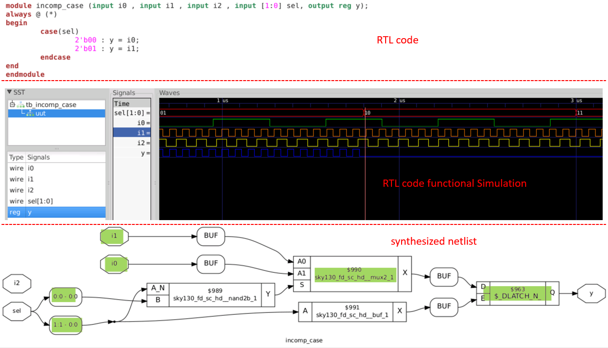
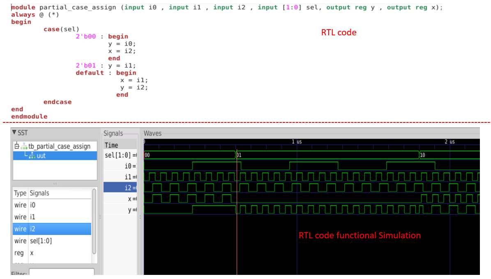
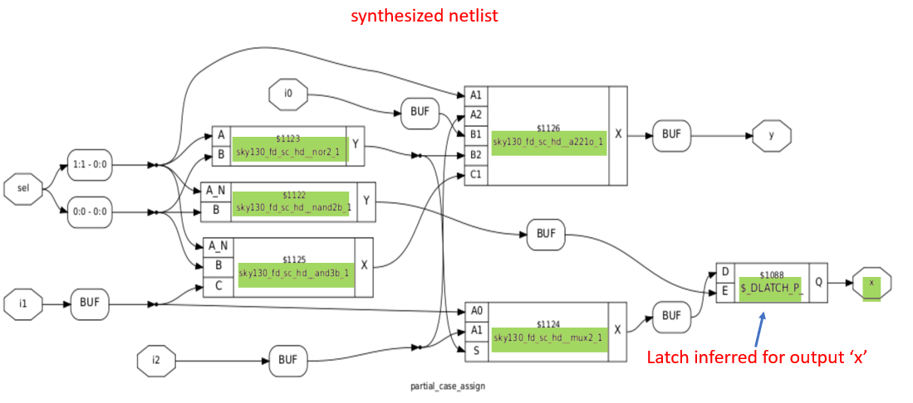
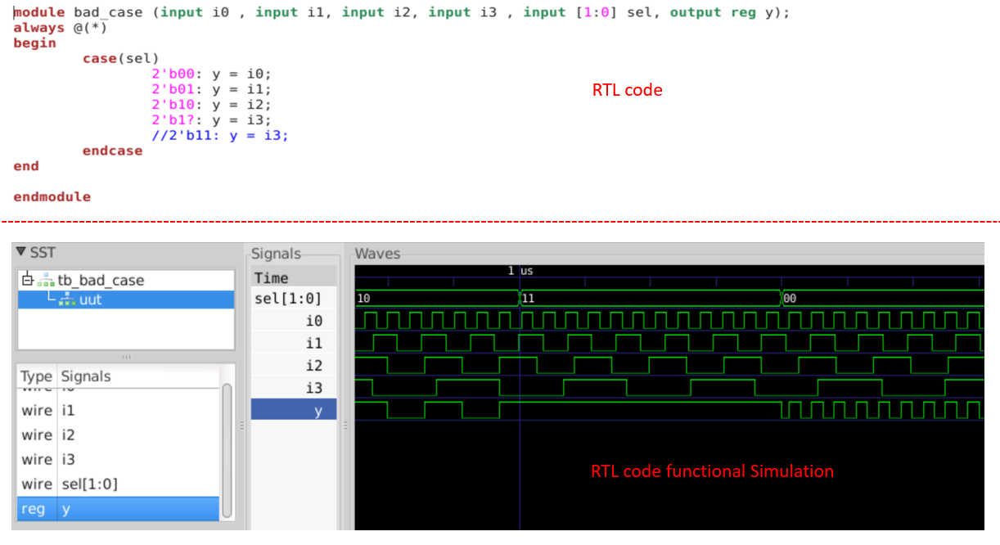
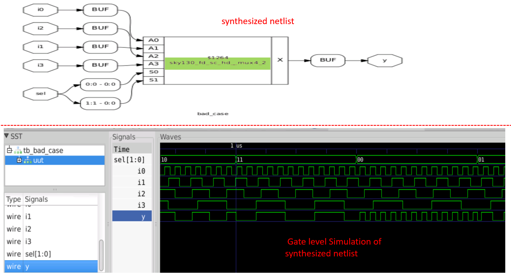
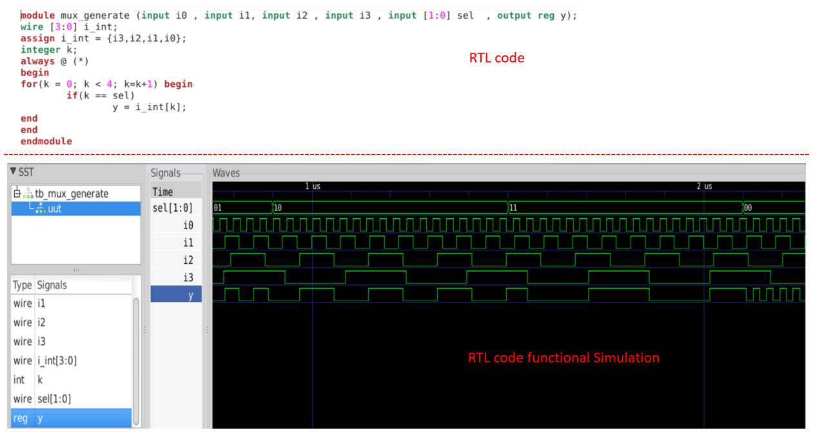
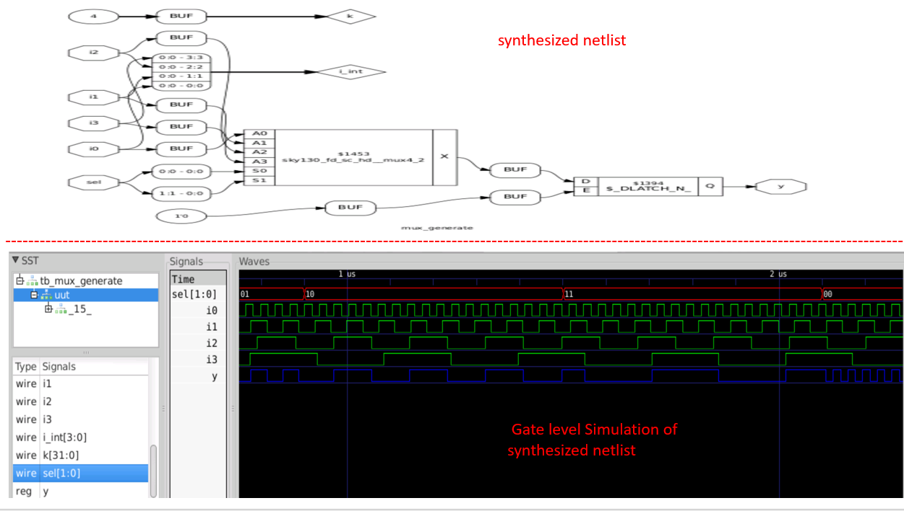
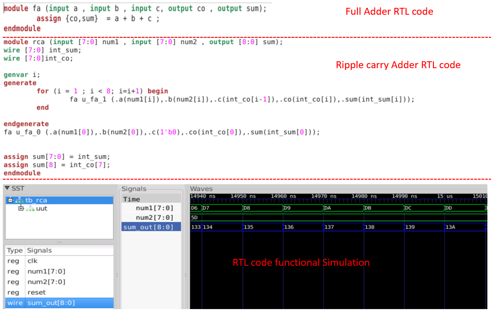
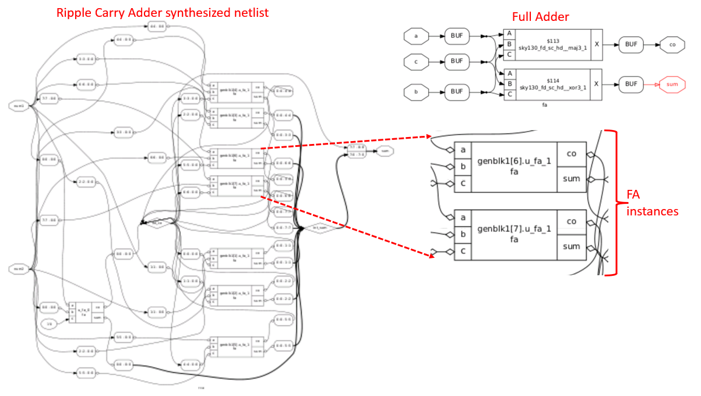
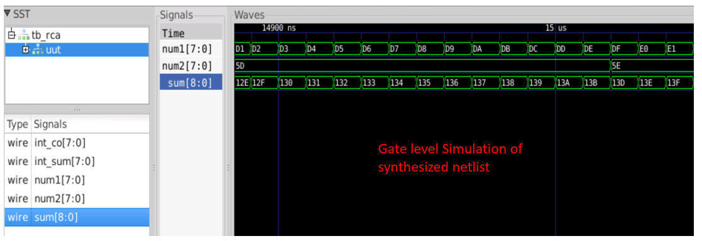

# Day 5 - Mastering Verilog Control Structures: From Logic to Hardware

## Introduction

The focus is on Verilog control structures that form the backbone of digital design. This session covers conditional statements (if-else), case constructs, and loop mechanisms that enable efficient hardware description and generation. Mastery of these control structures is essential for VLSI engineers, as they directly affect how RTL code maps to silicon. Poor usage can result in unintended latches, priority encoders instead of multiplexers, and synthesis-simulation mismatches that disrupt project timelines. This module provides professional coding techniques used in industry, ensuring Verilog code is synthesizable, efficient, and maintainable, delivering the intended behavior in hardware.

---

## 📖 Table of Contents

- [🚀 Introduction](#-introduction)
- [5.1 Conditional Logic with IF Statements](#51-conditional-logic-with-if-statements)
  - [IF Statement Fundamentals](#if-statement-fundamentals)
  - [Priority Logic Implementation](#priority-logic-implementation)
  - [Common Pitfalls: Inferred Latches](#common-pitfalls-inferred-latches)
  - [Best Practices for IF Statements](#best-practices-for-if-statements)
- [5.2 CASE Statements for Efficient Multiplexing](#52-case-statements-for-efficient-multiplexing)
  - [CASE vs IF: When to Use What](#case-vs-if-when-to-use-what)
  - [CASE Statement Architecture](#case-statement-architecture)
- [5.3 CASE Statement Design Challenges](#53-case-statement-design-challenges)
  - [Challenge 1: Incomplete CASE Statements](#challenge-1-incomplete-case-statements)
  - [Challenge 2: Partial Assignment Issues](#challenge-2-partial-assignment-issues)
  - [Challenge 3: Overlapping CASE Hazards](#challenge-3-overlapping-case-hazards)
- [5.4 Loop Constructs for Hardware Design](#54-loop-constructs-for-hardware-design)
  - [FOR Loop: Expression Evaluation](#for-loop-expression-evaluation)
  - [FOR Generate: Hardware Replication](#for-generate-hardware-replication)
  - [Loop Applications in Complex Designs](#loop-applications-in-complex-designs)
- [5.5 Advanced Hardware Generation Techniques](#55-advanced-hardware-generation-techniques)
  - [Scalable MUX Design with Loops](#scalable-mux-design-with-loops)
  - [Ripple Carry Adder Implementation](#ripple-carry-adder-implementation)
- [5.6 Day 5 Comprehensive Summary](#56-day-5-comprehensive-summary)
  - [Key Concepts Mastered](#key-concepts-mastered)
  - [Design Patterns Learned](#design-patterns-learned)
  - [Common Pitfalls and Solutions](#common-pitfalls-and-solutions)
- [📚 Resources](#resources)

---

## 5.1 Conditional Logic with IF Statements

### IF Statement Fundamentals

The IF statement is the cornerstone of conditional logic in Verilog, enabling designers to create priority-based decision trees in hardware. Unlike software programming, Verilog IF statements directly translate to hardware structures.

**Core Syntax Structure:**
```verilog
if (<condition_1>)          // Highest Priority
    <statements>
else if (<condition_2>)     // Second Priority  
    <statements>
else                        // Default/Lowest Priority
    <statements>
```

### Priority Logic Implementation

| **Priority Level** | **Condition** | **Hardware Implication** | **Use Case** |
|-------------------|---------------|-------------------------|--------------|
| **Highest (1st)** | `if (condition_1)` | First in priority chain | Critical conditions |
| **Medium (2nd)** | `else if (condition_2)` | Second in priority chain | Secondary conditions |
| **Lowest (Default)** | `else` | Catch-all condition | Error handling/default |

### Hardware Translation Patterns

| **IF Structure** | **Hardware Result** | **Resource Usage** | **Timing Impact** |
|------------------|-------------------|------------------|------------------|
| **Simple IF-ELSE** | 2:1 Multiplexer | Minimal | Single gate delay |
| **Nested IF-ELSE** | Priority Encoder + MUX | Moderate | Cascaded delays |
| **Multiple IF-ELSE** | Priority Logic Chain | High | Cumulative delays |

### Common Pitfalls: Inferred Latches

One of the most critical issues in IF statement usage is **unintentional latch inference**. This occurs when the IF statement doesn't cover all possible input conditions.

#### Problematic Code Example:
```verilog
module incomp_if (input i0, input i1, input i2, output reg y);
always @(*) begin
    if(i0)
        y <= i1;
    // Missing ELSE clause - DANGER!
end
endmodule
```

#### Root Cause Analysis:

| **Scenario** | **Code Behavior** | **Hardware Inference** | **Problem** |
|--------------|------------------|----------------------|-------------|
| **i0 = 1** | `y = i1` | Combinational path | ✅ Correct |
| **i0 = 0** | `y = ?` (undefined) | **Latch inferred** | ❌ Unintended |

#### Professional Solution:
```verilog
module complete_if (input i0, input i1, input i2, output reg y);
always @(*) begin
    if(i0)
        y = i1;
    else
        y = i2;  // Complete coverage
end
endmodule
```

### Best Practices for IF Statements

| **Practice** | **Benefit** | **Example** |
|--------------|-------------|-------------|
| **Complete Coverage** | Prevents latch inference | Always include `else` |
| **Priority Ordering** | Optimizes critical paths | Most critical conditions first |
| **Mutual Exclusivity** | Reduces hardware complexity | Non-overlapping conditions |
| **Default Values** | Ensures predictable behavior | Explicit default assignments |

---

## 5.2 CASE Statements for Efficient Multiplexing

### CASE vs IF: When to Use What

The choice between CASE and IF statements significantly impacts your design's efficiency and hardware implementation:

| **Design Aspect** | **IF Statements** | **CASE Statements** |
|-------------------|------------------|-------------------|
| **Best For** | Priority logic | Parallel decision making |
| **Hardware Result** | Priority encoder | Multiplexer |
| **Conditions** | 2-4 conditions | Multiple conditions (>4) |
| **Resource Usage** | Variable (depends on nesting) | Predictable |
| **Timing** | Variable delays | Uniform delays |
| **Code Readability** | Good for simple logic | Excellent for complex logic |

### CASE Statement Architecture

**Standard CASE Syntax:**
```verilog
case (select_expression)
    value_1: statement_1;
    value_2: statement_2;
    value_3: statement_3;
    default: default_statement;  // Critical for completeness
endcase
```

### Implementation Comparison

| **Logic Type** | **Implementation** | **Resource Count** | **Delay** |
|----------------|------------------|------------------|-----------|
| **4:1 MUX (CASE)** | Single 4:1 multiplexer | 1 MUX | 1 gate delay |
| **4:1 MUX (IF-ELSE)** | Priority encoder + logic | Multiple gates | 3+ gate delays |

---

## 5.3 CASE Statement Design Challenges

### Challenge 1: Incomplete CASE Statements

Incomplete CASE statements occur when not all possible input combinations are explicitly handled, leading to unintended latch inference.



#### Problem Analysis:
```verilog
// Problematic: Missing cases for sel = 2'b10, 2'b11
case(sel)
    2'b00: y = i0;
    2'b01: y = i1;
    // Missing 2'b10 and 2'b11 cases!
endcase
```

#### Impact Assessment:

| **sel Value** | **Expected Behavior** | **Actual Behavior** | **Hardware Result** |
|---------------|---------------------|-------------------|------------------|
| **2'b00** | `y = i0` | `y = i0` | ✅ Correct MUX |
| **2'b01** | `y = i1` | `y = i1` | ✅ Correct MUX |
| **2'b10** | Should be defined | `y` retains value | ❌ **Latch inferred** |
| **2'b11** | Should be defined | `y` retains value | ❌ **Latch inferred** |

#### Professional Solution:
```verilog
case(sel)
    2'b00: y = i0;
    2'b01: y = i1;
    2'b10: y = i2;
    2'b11: y = i3;
    default: y = i0;  // Explicit default handling
endcase
```

### Challenge 2: Partial Assignment Issues

Partial assignments occur when some outputs are not assigned in all CASE branches, creating selective latch inference.




#### Code Analysis:
```verilog
case(sel)
    2'b00: begin
        x = a;
        y = b;
    end
    2'b01: begin
        // x not assigned! - Partial assignment
        y = c;
    end
    default: begin
        x = d;
        y = e;
    end
endcase
```

#### Selective Latch Inference:

| **Output** | **sel = 2'b00** | **sel = 2'b01** | **default** | **Inference Result** |
|------------|----------------|----------------|-------------|-------------------|
| **x** | `x = a` | **Not assigned** | `x = d` | ❌ **Latch for x** |
| **y** | `y = b` | `y = c` | `y = e` | ✅ **MUX for y** |

### Challenge 3: Overlapping CASE Hazards

Overlapping CASE statements create synthesis-simulation mismatches due to ambiguous condition coverage.




#### Problematic Code:
```verilog
case(sel)
    2'b00: y = a;
    2'b01: y = b;
    2'b10: y = c;
    2'b1?: y = d;    // Overlaps with 2'b10!
    default: y = e;
endcase
```

#### Conflict Analysis:

| **sel Value** | **Matching Cases** | **Simulator Behavior** | **Synthesis Result** |
|---------------|--------------------|----------------------|-------------------|
| **2'b00** | Case 1 only | `y = a` | `y = a` ✅ |
| **2'b01** | Case 2 only | `y = b` | `y = b` ✅ |
| **2'b10** | Case 3 AND Case 4 | **Unpredictable** | `y = c` ❌ **Mismatch** |
| **2'b11** | Case 4 only | `y = d` | `y = d` ✅ |

---

## 5.4 Loop Constructs for Hardware Design

### FOR Loop: Expression Evaluation

FOR loops in Verilog serve a fundamentally different purpose than in software - they're used for repetitive expression evaluation within always blocks.

#### Key Characteristics:

| **Aspect** | **FOR Loop** | **Traditional Software Loop** |
|------------|--------------|------------------------------|
| **Location** | Inside `always` block | Anywhere in code |
| **Purpose** | Expression evaluation | Iterative operations |
| **Hardware** | No loop hardware generated | N/A |
| **Synthesis** | Unrolled at compile time | N/A |
| **Usage** | Repetitive logic patterns | Sequential processing |

#### Syntax and Structure:
```verilog
always @(*) begin
    for (i = 0; i < N; i = i + 1) begin
        // Repetitive expressions
        result[i] = expression_involving_i;
    end
end
```

### FOR Generate: Hardware Replication

Generate constructs enable automatic hardware replication, essential for creating scalable designs.

#### Key Characteristics:

| **Aspect** | **FOR Generate** | **Manual Instantiation** |
|------------|------------------|-------------------------|
| **Location** | Outside `always` block | Module level |
| **Purpose** | Hardware instantiation | Single instance creation |
| **Scalability** | Highly scalable | Limited scalability |
| **Maintainability** | Easy to modify | Cumbersome for large designs |
| **Code Reuse** | Excellent | Poor |

#### Syntax and Structure:
```verilog
genvar i;
generate
    for (i = 0; i < N; i = i + 1) begin : gen_block
        // Hardware instantiation
        module_name instance_name (.ports(connections[i]));
    end
endgenerate
```

### Loop Applications in Complex Designs

| **Design Pattern** | **FOR Loop Application** | **Generate Application** |
|-------------------|----------------------|----------------------|
| **Large MUX** | Selection logic evaluation | N/A |
| **Parallel Processing** | Multiple data path evaluation | Replicated processing units |
| **Memory Systems** | Address decoding logic | Memory bank instantiation |
| **Arithmetic Units** | Multi-bit operations | Bit-slice replication |

---

## 5.5 Advanced Hardware Generation Techniques

### Scalable MUX Design with Loops

Let's explore how FOR loops enable elegant, scalable multiplexer design:




#### Traditional vs Loop-Based Implementation:

**Traditional Approach (4:1 MUX):**
```verilog
case(sel)
    2'b00: y = i0;
    2'b01: y = i1;
    2'b10: y = i2;
    2'b11: y = i3;
endcase
```

**Loop-Based Approach (Scalable):**
```verilog
always @(*) begin
    y = 0;  // Default assignment
    for (int i = 0; i < 4; i++) begin
        if (sel == i)
            y = inputs[i];
    end
end
```

#### Scalability Comparison:

| **MUX Size** | **Traditional Lines** | **Loop Lines** | **Advantage** |
|--------------|---------------------|---------------|---------------|
| **4:1** | 8 lines | 6 lines | Minimal |
| **16:1** | 32 lines | 6 lines | **5x reduction** |
| **64:1** | 128 lines | 6 lines | **20x reduction** |

### Ripple Carry Adder Implementation

FOR Generate constructs excel in creating repetitive hardware structures like adders:





#### Manual vs Generate Implementation:

**Manual Instantiation (8-bit):**
```verilog
full_adder fa0 (.a(a[0]), .b(b[0]), .cin(1'b0), .sum(sum[0]), .cout(c0));
full_adder fa1 (.a(a[1]), .b(b[1]), .cin(c0), .sum(sum[1]), .cout(c1));
full_adder fa2 (.a(a[2]), .b(b[2]), .cin(c1), .sum(sum[2]), .cout(c2));
// ... 5 more lines
```

**Generate-Based Implementation:**
```verilog
genvar i;
generate
    for (i = 0; i < 8; i = i + 1) begin : fa_gen
        if (i == 0) begin
            full_adder fa (.a(a[i]), .b(b[i]), .cin(1'b0), 
                          .sum(sum[i]), .cout(carry[i]));
        end else begin
            full_adder fa (.a(a[i]), .b(b[i]), .cin(carry[i-1]), 
                          .sum(sum[i]), .cout(carry[i]));
        end
    end
endgenerate
```

#### Implementation Benefits:

| **Aspect** | **Manual** | **Generate** | **Improvement** |
|------------|------------|-------------|----------------|
| **Code Length** | 8 lines | 3 lines | **60% reduction** |
| **Scalability** | Rewrite for each size | Parameter change only | **Infinite** |
| **Error Prone** | High (copy-paste errors) | Low | **Significant** |
| **Maintainability** | Poor | Excellent | **Professional** |

---

## 5.6 Day 5 Summary

### Key Concepts Mastered

| **Control Structure** | **Primary Use** | **Hardware Result** | **Best Practice** |
|----------------------|----------------|-------------------|------------------|
| **IF Statements** | Priority logic | Priority encoder/MUX | Always include `else` |
| **CASE Statements** | Parallel selection | Multiplexer | Use `default` clause |
| **FOR Loops** | Expression evaluation | Unrolled logic | Inside `always` blocks |
| **FOR Generate** | Hardware replication | Instantiated modules | Outside `always` blocks |

### Design Patterns Learned

| **Pattern** | **Application** | **Benefit** | **Industry Usage** |
|-------------|----------------|------------|------------------|
| **Complete Coverage** | All IF/CASE paths defined | No unintended latches | Critical for ASIC design |
| **Default Handling** | Explicit default cases | Predictable behavior | Required for safety systems |
| **Scalable Design** | Loop-based implementations | Maintainable code | Essential for configurable IP |
| **Hardware Replication** | Generate constructs | Efficient large designs | Standard in memory/processor design |

### Common Pitfalls and Solutions

| **Pitfall** | **Consequence** | **Detection Method** | **Professional Solution** |
|-------------|---------------|-------------------|------------------------|
| **Incomplete IF** | Unintended latches | Synthesis warnings | Complete `if-else` coverage |
| **Incomplete CASE** | Latch inference | Static timing analysis | Always use `default` |
| **Partial Assignment** | Selective latches | Simulation mismatch | Assign all outputs everywhere |
| **Overlapping CASE** | Unpredictable behavior | Functional verification | Mutually exclusive conditions |

### Technical Skills Developed

✅ **Advanced Control Logic Design**
- Master IF statement priority structures
- Implement efficient CASE-based multiplexers  
- Avoid common latch inference pitfalls

✅ **Professional Coding Practices**
- Write synthesizable, maintainable code
- Apply industry-standard design patterns
- Debug synthesis-simulation mismatches

✅ **Hardware Generation Techniques**
- Use FOR loops for scalable logic
- Apply Generate constructs for hardware replication
- Design configurable, reusable IP blocks

✅ **Verification and Debug Skills**
- Identify problematic code patterns
- Analyze synthesis reports for warnings
- Correlate RTL behavior with hardware implementation

### Industry Best Practices Summary

| **Category** | **Best Practice** | **Rationale** |
|--------------|------------------|---------------|
| **Code Style** | Complete coverage in all conditional statements | Prevents unintended sequential logic |
| **Verification** | Always perform GLS after RTL changes | Catches synthesis-simulation mismatches |
| **Scalability** | Use parameterized Generate constructs | Enables IP reuse and configurability |
| **Documentation** | Comment all complex control structures | Improves maintainability and review process |

---

## 📚 Resources

### Reading Materials
- **"Advanced Digital Design with the Verilog HDL"** by Michael D. Ciletti
- **"Digital Design and Computer Architecture"** by Harris & Harris  
- **"Writing Testbenches: Functional Verification of HDL Models"** by Janick Bergeron

### Industry Standards and Guidelines
- **IEEE 1364-2005**: Verilog Hardware Description Language Standard
- **IEEE 1800-2017**: SystemVerilog Unified Hardware Design Language

---

